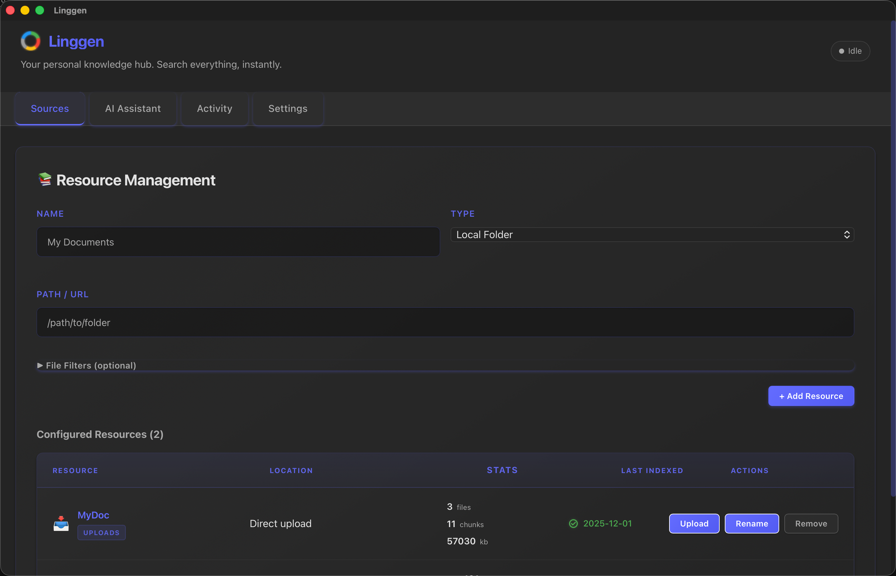

`<p align="center">

<br />
<a href="https://linggen.dev">https://linggen.dev</a>

</p>

## Linggen

**Linggen** is a **local-first RAG + MCP memory layer** for AI coding assistants.  
It runs entirely on your machine, is **free for individuals and teams**, and is built for:

- **Working across many projects** with one shared memory layer
- **Navigating huge codebases and documentation sets**
- **Connecting multiple IDEs/agents via MCP** (Cursor, Zed, Windsurf, etc.)

Nothing leaves your machine by default: embeddings, indexes, and search all run locally.



---

## What You Can Do

- **Index your world**: local folders, codebases, docs, and notes
- **Semantic search + AI chat** over everything you’ve indexed
- **Expose an MCP server** at `http://localhost:8787/mcp/sse` for compatible tools
- **Run it for a team** on a shared machine and point everyone’s MCP config at it

See the full product docs at **[linggen.dev](https://linggen.dev)**.

---

## Install

- Install the CLI:
  ```bash
  curl -fsSL https://linggen.dev/install-cli.sh | bash
  ```
- Install the runtime:
  ```bash
  linggen install
  ```
- Start the server:
  ```bash
  linggen serve
  ```
- On first run, it downloads an embedding model (~100MB) and starts a local backend at `http://localhost:8787`.

> Currently macOS only. Windows & Linux are planned.

---

## MCP Setup (Cursor)

Linggen starts an MCP server at `http://localhost:8787/mcp/sse`.
Add this to `~/.cursor/mcp.json` to connect Cursor:

```json
{
  "mcpServers": {
    "linggen": {
      "url": "http://localhost:8787/mcp/sse"
    }
  }
}
```

Restart Cursor and you should see `linggen` as a connected MCP server.

---

## This Repo

This repo is the **Linggen landing page and docs site**, built with **React** and **Vite**, deployed to **Cloudflare Pages**.

```bash
npm install
npm run dev
```

`
